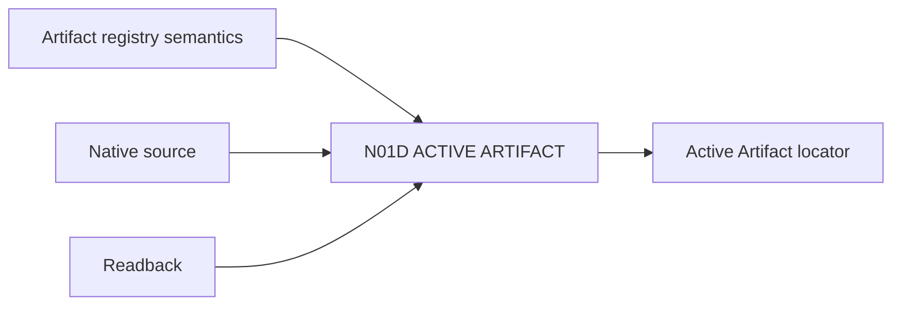

# N01D｜ACTIVE ARTIFACT

[← Parent](../N01_HOME.md) · [← Atomic Node Index](../ATOMIC_NODE_INDEX.md)

| Field | Value |
|---|---|
| Node ID | N01D |
| Parent | N01 HOME |
| Type | Atomic Product Capability |
| Product job | 告诉用户当前判断应回到哪个真实 artifact/revision |
| Inputs | Artifact registry semantics; Native source; Readback |
| Outputs | Active Artifact locator |
| Authority | Artifact authority remains owner-native |
| Primary metric | Active Artifact Correction Rate |
| Release priority | P0 |
| Doc state | WORKING |

## Context Graph

## Product Contract

最新文件不自动等于 Active Artifact；角色、revision、native status 和 readback 必须可见。

## Requirement Links

- `HOME-F04`
- `ART-F01`
- `ART-F02`
- `ART-F03`

## Acceptance

1. Preview/Export 不默认替代 native master
2. Active Artifact 绑定 revision 与 last readback
3. 可从 HOME 直接进入 N06 ARTIFACTS

## Failure / Degraded Behaviour

- native unavailable → 标记 unavailable 并保留 logical identity
- role conflict → 不自动选 winner

## Events / Metrics

- `active_artifact_resolved`
- `artifact_role_conflict`

## Relations

- Consumes N06A Artifact Identity
- Feeds N01A Resume Snapshot
