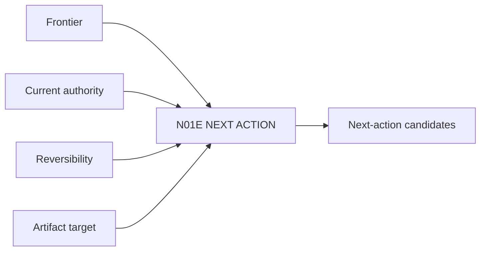

# N01E｜NEXT ACTION

[← Parent](../N01_HOME.md) · [← Atomic Node Index](../ATOMIC_NODE_INDEX.md)

| Field | Value |
|---|---|
| Node ID | N01E |
| Parent | N01 HOME |
| Type | Atomic Product Capability |
| Product job | 给出 1–3 个下一步真正可执行且有设计价值的动作 |
| Inputs | Frontier; Current authority; Reversibility; Artifact target |
| Outputs | Next-action candidates |
| Authority | System recommends; execution gated by N10C/N10D |
| Primary metric | Next-action Acceptance / Correction |
| Release priority | P0 |
| Doc state | WORKING |

## Context Graph

## Product Contract

每个 action 必须说明 target、design consequence、artifact/surface、reversibility 和 expected readback。

## Requirement Links

- `HOME-F06`
- `UN-P03`
- `INT-F16`

## Acceptance

1. ‘继续’可落到具体对象和动作
2. 没有 exploration gap 时不推荐‘再生成更多方案’
3. Human-only choice 不伪装成自动 action

## Failure / Degraded Behaviour

- action authority unclear → route N10D
- 多个同级 next actions → present bounded set

## Events / Metrics

- `next_action_shown`
- `next_action_selected`
- `next_action_started`

## Relations

- Consumes N01B Frontier
- Routes N03/N06/N07
- Checked by N10C Autonomy/Human Stop
