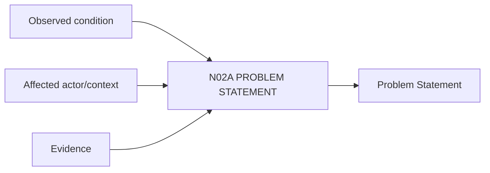

# N02A｜PROBLEM STATEMENT

[← Parent](../N02_FOCUS.md) · [← Atomic Node Index](../ATOMIC_NODE_INDEX.md)

| Field | Value |
|---|---|
| Node ID | N02A |
| Parent | N02 FOCUS |
| Type | Atomic Product Capability |
| Product job | 当 design situation 的核心确实是 problem 时，把 observable condition 与 proposed solution 分开 |
| Inputs | Observed condition; Affected actor/context; Evidence |
| Outputs | Problem Statement |
| Authority | Human-led framing |
| Primary metric | Problem Reframe Rate |
| Release priority | P0 |
| Doc state | WORKING |

## Context Graph

## Product Contract

Problem 是 Design Situation 的一种，不是所有设计项目的强制入口。用户提出的解决方案可以保留，但不能自动替代 problem definition。

## Requirement Links

- `FOCUS-F01`
- `SR-PF`

## Acceptance

1. Problem 包含 condition/actor/impact/evidence status
2. ‘加一个大屏’不会自动变成 problem
3. 未知部分保持 unknown
4. opportunity / ambition / cultural meaning 等非 problem 情境不会被强行改写成 problem

## Failure / Degraded Behaviour

- 只有 solution request → 系统提出 candidate problem 或 opportunity framing，不写成 Current truth

## Events / Metrics

- `problem_created`
- `problem_reframed`

## Relations

- Feeds N02B Current Question
- Consumes N08 Evidence
