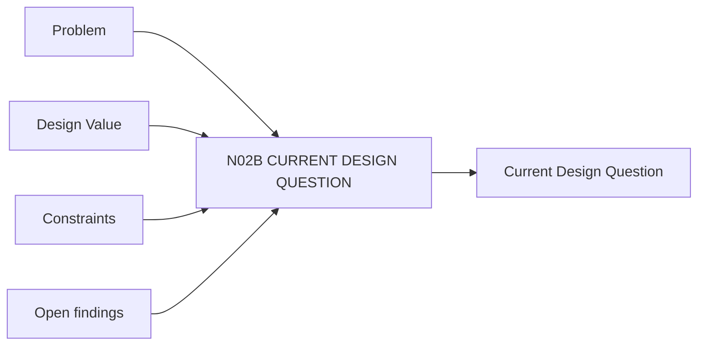

# N02B｜CURRENT DESIGN QUESTION

[← Parent](../N02_FOCUS.md) · [← Atomic Node Index](../ATOMIC_NODE_INDEX.md)

| Field | Value |
|---|---|
| Node ID | N02B |
| Parent | N02 FOCUS |
| Type | Atomic Product Capability |
| Product job | 维护当前最值得通过设计行动逐步回答的问题 |
| Inputs | Problem; Design Value; Constraints; Open findings |
| Outputs | Current Design Question |
| Authority | Human can confirm/reframe; system may propose |
| Primary metric | Question Clarity / Correction |
| Release priority | P0 |
| Doc state | WORKING |

## Context Graph

## Product Contract

Question 必须是可设计、可比较、可通过 artifact/evidence 推进的问题，不是 task。

## Requirement Links

- `FOCUS-F02`
- `UN-P02`

## Acceptance

1. active scope 有可识别 Current Question
2. Question 能说明需要什么 artifact/evidence 来推进
3. ‘做三张图’不作为 Design Question

## Failure / Degraded Behaviour

- 问题过宽 → propose smaller decision objects
- 问题过局部且反复失败 → suggest scale escalation

## Events / Metrics

- `question_created`
- `question_confirmed`
- `question_reopened`

## Relations

- Consumes N02A/N02C/N02D
- Feeds N01B/N03A/N03B/N06

