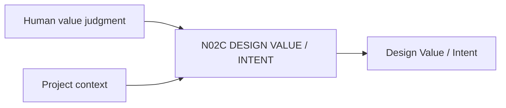

# N02C｜DESIGN VALUE / INTENT

[← Parent](../N02_FOCUS.md) · [← Atomic Node Index](../ATOMIC_NODE_INDEX.md)

| Field | Value |
|---|---|
| Node ID | N02C |
| Parent | N02 FOCUS |
| Type | Atomic Product Capability |
| Product job | 表达设计为何重要，以及哪些价值应被后续实现保护 |
| Inputs | Human value judgment; Project context |
| Outputs | Design Value / Intent |
| Authority | High-impact value definition is Human-only/Human-led |
| Primary metric | Intent Drift Detection / Human Correction |
| Release priority | P0 |
| Doc state | WORKING |

## Context Graph

## Product Contract

VALUE 是 why it matters；RELATION 是 how value is carried；IMPLEMENTATION 是 current realization。三者必须分开。

## Requirement Links

- `FOCUS-F03`
- `UN-P07`
- `SR-DV`

## Acceptance

1. ‘使用木材’不会直接成为 Value
2. Value change 保留 rationale
3. 系统不会静默改写 Value

## Failure / Degraded Behaviour

- Value vague → system may ask/offer contrast after material examples
- conflicting values → expose trade-off

## Events / Metrics

- `design_value_created`
- `design_value_changed`
- `intent_drift_candidate`

## Relations

- Feeds N02B/N03/N04/N05
- Checked by N03B4 Intent Check

