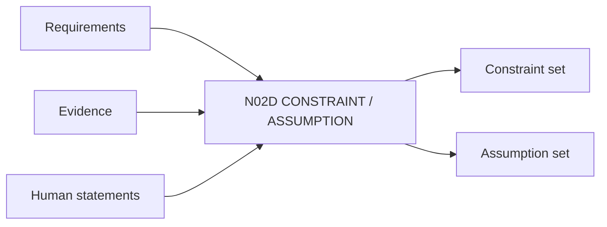

# N02D｜CONSTRAINT / ASSUMPTION

[← Parent](../N02_FOCUS.md) · [← Atomic Node Index](../ATOMIC_NODE_INDEX.md)

| Field | Value |
|---|---|
| Node ID | N02D |
| Parent | N02 FOCUS |
| Type | Atomic Product Capability |
| Product job | 区分约束强度与仍需验证的假设 |
| Inputs | Requirements; Evidence; Human statements |
| Outputs | Constraint set; Assumption set |
| Authority | Evidence/owner rules determine status; AI cannot upgrade silently |
| Primary metric | Stale Assumption Detection |
| Release priority | P0 |
| Doc state | WORKING |

## Context Graph

## Product Contract

Constraint 支持 HARD/SOFT/UNKNOWN；Assumption 必须记录 consequence-if-false 和 evidence trigger。

## Requirement Links

- `FOCUS-F05`
- `UN-P08`
- `UN-P27`

## Acceptance

1. Assumption ≠ Fact
2. UNKNOWN 不静默升级 HARD
3. Assumption 被推翻后触发 impact analysis

## Failure / Degraded Behaviour

- source missing → UNKNOWN
- conflicting sources → link N08D Contradiction

## Events / Metrics

- `constraint_recorded`
- `assumption_created`
- `assumption_invalidated`

## Relations

- Feeds N02B/N03A/N05B
- Uses N08 nodes

