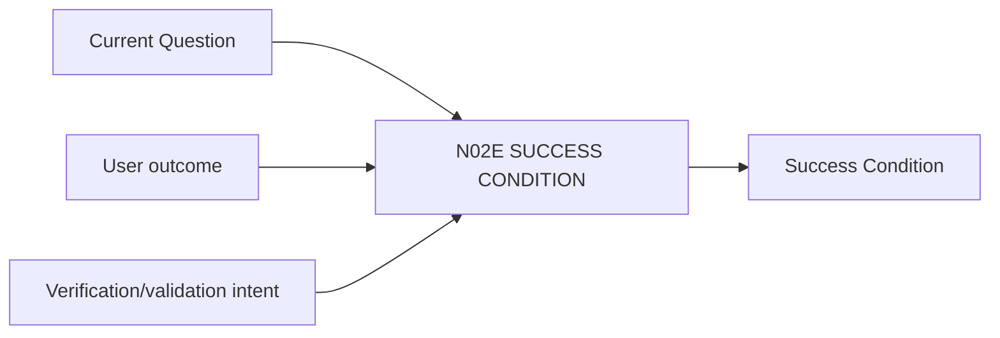

# N02E｜SUCCESS CONDITION

[← Parent](../N02_FOCUS.md) · [← Atomic Node Index](../ATOMIC_NODE_INDEX.md)

| Field | Value |
|---|---|
| Node ID | N02E |
| Parent | N02 FOCUS |
| Type | Atomic Product Capability |
| Product job | 定义当前 Design Question 什么情况下算被足够解决 |
| Inputs | Current Question; User outcome; Verification/validation intent |
| Outputs | Success Condition |
| Authority | Human-led |
| Primary metric | Success-condition Rework |
| Release priority | P1 |
| Doc state | WORKING |

## Context Graph

## Product Contract

Success Condition 描述 design outcome，不以文件数量或 Agent 完成度替代。

## Requirement Links

- `FOCUS-F06`

## Acceptance

1. condition 可被后续 artifact/evidence 检查
2. 不使用‘完成5张图’作为核心成功标准
3. 区分 verification 与 validation

## Failure / Degraded Behaviour

- 无法观察 → rewrite as testable outcome

## Events / Metrics

- `success_condition_defined`
- `success_condition_revised`

## Relations

- Feeds N02F/N07D/N07E

