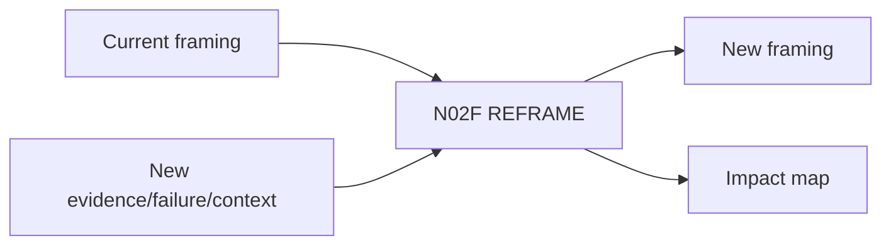

# N02F｜REFRAME

[← Parent](../N02_FOCUS.md) · [← Atomic Node Index](../ATOMIC_NODE_INDEX.md)

| Field | Value |
|---|---|
| Node ID | N02F |
| Parent | N02 FOCUS |
| Type | Atomic Product Capability |
| Product job | 在新证据/失败/情境变化时重构问题而不全局重置 |
| Inputs | Current framing; New evidence/failure/context |
| Outputs | New framing; Impact map |
| Authority | Consequential reframe is Human-led |
| Primary metric | Reframe-to-Recovery Time |
| Release priority | P0 |
| Doc state | WORKING |

## Context Graph

## Product Contract

Reframe 必须同时指出 remains-valid / revisit / irrelevant / new-unknown。

## Requirement Links

- `FOCUS-F07`
- `FOCUS-F08`
- `UN-P36`

## Acceptance

1. Reframe 保留仍有效 work
2. affected decisions/artifacts 明确
3. 不会默认 project reset

## Failure / Degraded Behaviour

- impact unknown → preserve UNKNOWN scope rather than delete work

## Events / Metrics

- `reframe_proposed`
- `reframe_accepted`
- `reframe_impact_created`

## Relations

- Uses N05B/N05C
- Updates N02B/N01B
