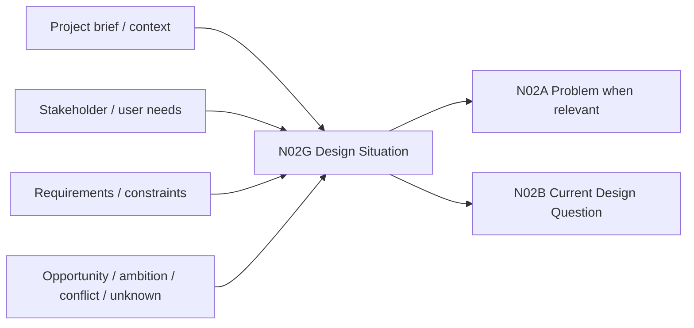

# N02G｜DESIGN SITUATION / BRIEF

[← Parent](../N02_FOCUS.md) · [← Atomic Node Index](../ATOMIC_NODE_INDEX.md)

| Field | Value |
|---|---|
| Node ID | N02G |
| Parent | N02 FOCUS |
| Type | Atomic Framing Node |
| Product job | 把新项目或重大阶段变化的 brief/context 转成可追踪的 design situation，而不强迫所有设计从“problem”开始 |
| Inputs | Project context; stakeholder/user needs; requirements; opportunities; ambitions; conflicts; unknowns |
| Outputs | Design Situation; framing candidates; Project-context gaps |
| Authority | Human-led framing; evidence/owner rules determine project facts |
| Primary metric | Brief Reframe / Missing-context Correction |
| Release priority | P0 |
| Doc state | WORKING |

## Context Graph



## Product Contract

OLEANDER must support projects driven by a **problem, opportunity, ambition, requirement, conflict or unknown**. `Problem Statement` is one framing type, not a universal gateway.

## Minimum Situation Fields

```text
project_context
actors / affected users
stated brief
known requirements
design opportunity / problem / ambition
known constraints
important unknowns
evidence status
scope / scale
```

## Requirement Links

- `FOCUS-F10`
- `UN-P02`
## Acceptance

1. new project can enter FOCUS without inventing a “problem”
2. stakeholder statement is not automatically Project Fact
3. brief requirements remain distinguishable from Design Value
4. missing critical project context becomes an explicit gap, not a guessed default

## Failure / Degraded Behaviour

- incomplete brief → create bounded framing candidates + explicit gaps
- conflicting stakeholder briefs → preserve conflict and route to N11 scoped rights when consequential

## Events / Metrics

- `design_situation_created`
- `brief_gap_detected`

## Relations

- Feeds N02A/N02B/N02C/N02D
- Uses N08 source/evidence semantics and N11 people/authority
