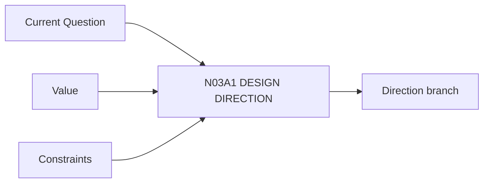

# N03A1｜DESIGN DIRECTION

[← Parent](../N03A_EXPLORE.md) · [← Atomic Node Index](../ATOMIC_NODE_INDEX.md)

| Field | Value |
|---|---|
| Node ID | N03A1 |
| Parent | N03A EXPLORE |
| Type | Atomic Studio Capability |
| Product job | 建立一个可比较的候选设计方向及其机制签名 |
| Inputs | Current Question; Value; Constraints |
| Outputs | Direction branch |
| Authority | AI may propose; Human owns consequential selection |
| Primary metric | Direction Usefulness |
| Release priority | P0 |
| Doc state | WORKING |

## Context Graph

## Product Contract

Direction 必须说明 what changes / why / mechanism / consequence / unknowns。

## Requirement Links

- `EXP-F01`
- `EXP-F02`

## Acceptance

1. 方向不是 mood/style 名称
2. 有 mechanism signature
3. 绑定 decision object

## Failure / Degraded Behaviour

- 只有视觉描述 → incomplete direction

## Events / Metrics

- `design_direction_created`
- `mechanism_signature_recorded`

## Relations

- Feeds N03A2/N04

