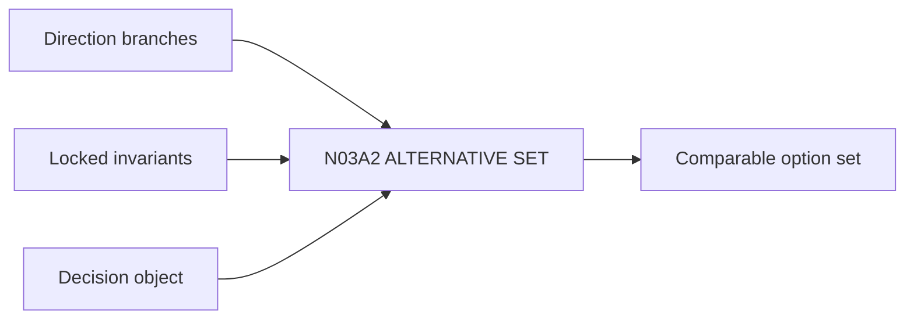

# N03A2｜ALTERNATIVE SET

[← Parent](../N03A_EXPLORE.md) · [← Atomic Node Index](../ATOMIC_NODE_INDEX.md)

| Field | Value |
|---|---|
| Node ID | N03A2 |
| Parent | N03A EXPLORE |
| Type | Atomic Studio Capability |
| Product job | 把多个方向放进同一个可公平比较的 decision world |
| Inputs | Direction branches; Locked invariants; Decision object |
| Outputs | Comparable option set |
| Authority | System structures; Human decides |
| Primary metric | Comparable Set Quality |
| Release priority | P0 |
| Doc state | WORKING |

## Context Graph

## Product Contract

同一 comparison world 要共享 decision object、key unknown、locked invariants 和足够可比的 fidelity。

## Requirement Links

- `EXP-F04`
- `CMP-F09`

## Acceptance

1. fidelity mismatch 可见
2. option set 不是不同问题的混合
3. 每个 branch 有 exact ID/revision

## Failure / Degraded Behaviour

- 不可比 → route artifact normalization before Human choice

## Events / Metrics

- `option_space_created`
- `comparison_world_created`

## Relations

- Consumes N03A1/N06
- Feeds N03A3/N04A
