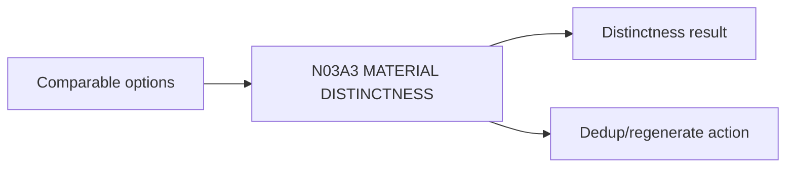

# N03A3｜MATERIAL DISTINCTNESS

[← Parent](../N03A_EXPLORE.md) · [← Atomic Node Index](../ATOMIC_NODE_INDEX.md)

| Field | Value |
|---|---|
| Node ID | N03A3 |
| Parent | N03A EXPLORE |
| Type | Atomic Studio Capability |
| Product job | 判断候选是否在机制/关系/后果上真正不同 |
| Inputs | Comparable options |
| Outputs | Distinctness result; Dedup/regenerate action |
| Authority | System may flag; Human may override with rationale |
| Primary metric | Material Divergence / Cosmetic Duplicate |
| Release priority | P0 |
| Doc state | WORKING |

## Context Graph

## Product Contract

颜色、字体、轻微形态变化不能自动算新方向。

## Requirement Links

- `EXP-F03`
- `EXP-F09`

## Acceptance

1. 至少检查 relation/mechanism/consequence/artifact expression
2. cosmetic duplicate 不计 exploration coverage

## Failure / Degraded Behaviour

- 差异不足 → dedup/regenerate
- 无法判断 → Human review

## Events / Metrics

- `material_distinctness_reviewed`
- `cosmetic_duplicate_detected`

## Relations

- Feeds N04
- May trigger N03A1 new direction

