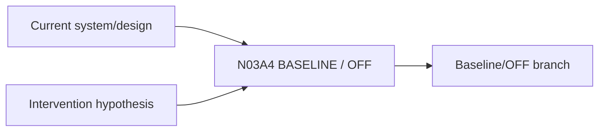

# N03A4｜BASELINE / OFF

[← Parent](../N03A_EXPLORE.md) · [← Atomic Node Index](../ATOMIC_NODE_INDEX.md)

| Field | Value |
|---|---|
| Node ID | N03A4 |
| Parent | N03A EXPLORE |
| Type | Atomic Studio Capability |
| Product job | 在因果相关时把 no-change / OFF 作为真实可比较选项 |
| Inputs | Current system/design; Intervention hypothesis |
| Outputs | Baseline/OFF branch |
| Authority | System may propose |
| Primary metric | Baseline Consideration Rate |
| Release priority | P1 |
| Doc state | WORKING |

## Context Graph

## Product Contract

产品不假设增加设计介入总是更好。

## Requirement Links

- `EXP-F08`

## Acceptance

1. baseline 与干预方案可在同一 decision world 比较
2. 不把 OFF 当失败

## Failure / Degraded Behaviour

- baseline causally irrelevant → omit with rationale

## Events / Metrics

- `baseline_branch_created`

## Relations

- Feeds N03A2/N04

