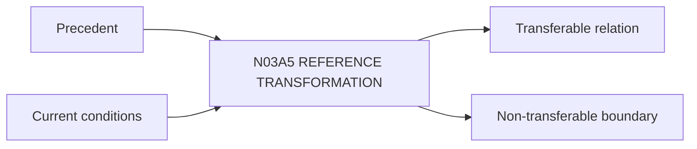

# N03A5｜REFERENCE TRANSFORMATION

[← Parent](../N03A_EXPLORE.md) · [← Atomic Node Index](../ATOMIC_NODE_INDEX.md)

| Field | Value |
|---|---|
| Node ID | N03A5 |
| Parent | N03A EXPLORE |
| Type | Atomic Studio Capability |
| Product job | 把 precedent 的可转移关系翻译进当前项目，而不是复制结果 |
| Inputs | Precedent; Current conditions |
| Outputs | Transferable relation; Non-transferable boundary |
| Authority | System assists; Human/domain validates applicability |
| Primary metric | Precedent Transfer Correction |
| Release priority | P1 |
| Doc state | WORKING |

## Context Graph

## Product Contract

每个 reference 必须说明 transferable / conditional / non-transferable。

## Requirement Links

- `EXP-F06`
- `KNW-F08`

## Acceptance

1. 不只记录‘参考某项目’
2. 明确不同条件与当前 consequence

## Failure / Degraded Behaviour

- source insufficient → claim ceiling lowered

## Events / Metrics

- `precedent_transfer_created`

## Relations

- Uses N08B/N08C
- Feeds N03A1
