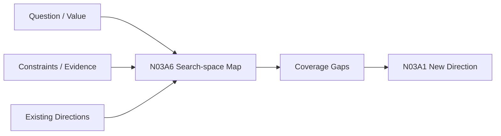

# N03A6｜SEARCH-SPACE MAP

[← Parent](../N03A_EXPLORE.md) · [← Atomic Node Index](../ATOMIC_NODE_INDEX.md)

| Field | Value |
|---|---|
| Node ID | N03A6 |
| Parent | N03A EXPLORE |
| Type | Atomic Studio Capability |
| Product job | 显式描述当前设计问题可探索的关键机制维度、已覆盖区域与重要空白 |
| Inputs | Design Question; Design Value; Constraints; Evidence; Existing directions |
| Outputs | Search-space map; Coverage gaps; Exploration hypotheses |
| Authority | AI may propose search dimensions; Human may correct what matters |
| Primary metric | Search-space Coverage Usefulness |
| Release priority | P0 |
| Doc state | WORKING |

## Context Graph

## Product Contract

Explore must not equate “three outputs” with “search complete”. The system should identify materially meaningful dimensions or mechanism families and state which regions are **covered / uncovered / intentionally excluded / unknown**.

## Requirement Links

- `EXP-F05`
## Acceptance

1. dimensions are tied to the current design question, not generic ideation prompts
2. covered and uncovered regions are explicit
3. unexplored region can trigger new direction generation
4. search-space map can remain partial/unknown rather than pretending completeness

## Failure / Degraded Behaviour

- design question too vague → return to N02B
- domain mechanism unknown → mark UNKNOWN and use N03B3/N08 rather than invent domain truth

## Events / Metrics

- `search_space_mapped`
- `search_space_gap_detected`

## Relations

- Feeds N03A1/N03A2/N03A7
- Consumes N02B/N02C/N02D/N08
