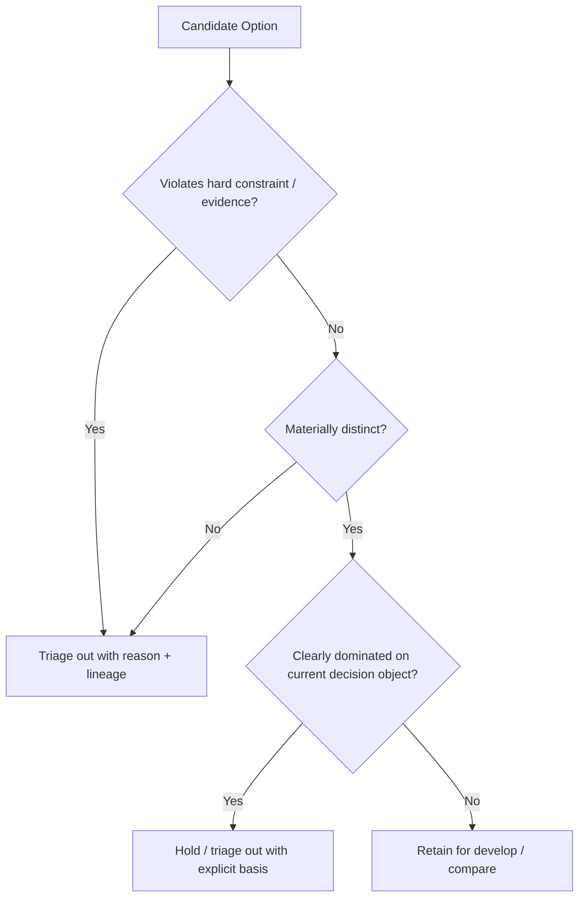

# N03A7｜AI OPTION TRIAGE

[← Parent](../N03A_EXPLORE.md) · [← Atomic Node Index](../ATOMIC_NODE_INDEX.md)

| Field | Value |
|---|---|
| Node ID | N03A7 |
| Parent | N03A EXPLORE |
| Type | Atomic Studio Capability |
| Product job | 在要求 Human 判断前，先由 AI 去重、淘汰明显弱/无效候选并保留有解释的 lineage |
| Inputs | Alternative set; Material distinctness; Constraints; Evidence; Search-space map |
| Outputs | Retained branches; Triaged-out-from-presentation branches + reason; Remaining coverage gaps |
| Authority | AI may apply reversible/session-local triage to clearly invalid/redundant candidates; it cannot issue Human REJECT, Design KEEP or silently alter Project Current |
| Primary metric | Human Review Burden / Useful Option Ratio |
| Release priority | P0 |
| Doc state | WORKING |

## Context Graph

## Product Contract

Human attention is scarce. OLEANDER should not present every generated branch. It should perform bounded **AI critique / dedup / invalidation / triage** before asking for a consequential choice.

## Requirement Links

- `EXP-F10`
- `EXP-F03`
## Acceptance

1. triaged-out branch retains identity, lineage and reason
2. AI does not collapse a genuine value trade-off into an automatic winner
3. hard-constraint violation, cosmetic duplication and weak evidence are distinguishable reasons
4. search-space gap can cause continued exploration instead of premature Human choice

## Failure / Degraded Behaviour

- candidate dominance depends on Human value judgment → retain and route N04 Compare
- evidence uncertain → do not auto-retire solely from unsupported inference

## Events / Metrics

- `option_triaged`
- `branch_triaged_out`
- `branch_retained_for_human`

## Relations

- Consumes N03A2/N03A3/N03A6/N08
- Feeds N04/N03B
- Triaged-out candidates remain recoverable exploration lineage; N09B rejected-direction status is created only by valid Human/owner rejection or hold semantics
