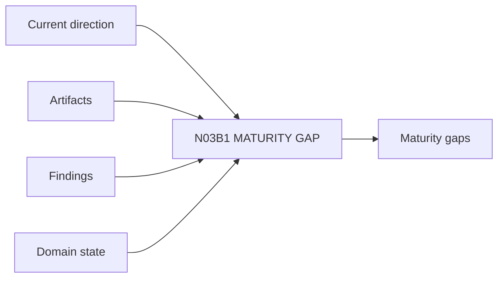

# N03B1｜MATURITY GAP

[← Parent](../N03B_DEVELOP.md) · [← Atomic Node Index](../ATOMIC_NODE_INDEX.md)

| Field | Value |
|---|---|
| Node ID | N03B1 |
| Parent | N03B DEVELOP |
| Type | Atomic Studio Capability |
| Product job | 指出当前设计真正缺少的分辨率而非 completion % |
| Inputs | Current direction; Artifacts; Findings; Domain state |
| Outputs | Maturity gaps |
| Authority | System suggests; professional judgment may override |
| Primary metric | Maturity-gap Correction |
| Release priority | P1 |
| Doc state | WORKING |

## Context Graph

## Product Contract

Representation completeness 不等于 professional/design maturity。

## Requirement Links

- `DEV-F01`

## Acceptance

1. gap 指向具体 dimension/relationship
2. 不以页数/文件数代替成熟度

## Failure / Degraded Behaviour

- domain process OPEN → professional maturity remains bounded

## Events / Metrics

- `maturity_gap_created`

## Relations

- Feeds N03B2
