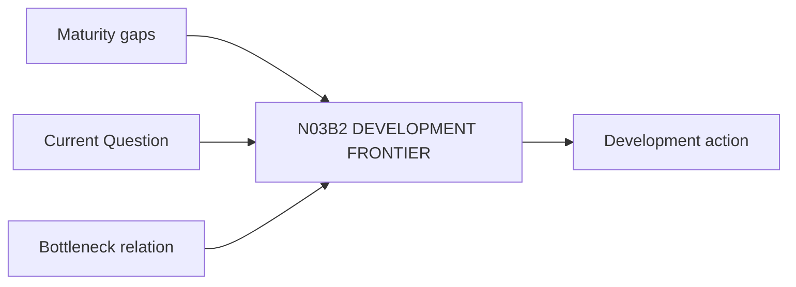

# N03B2｜DEVELOPMENT FRONTIER

[← Parent](../N03B_DEVELOP.md) · [← Atomic Node Index](../ATOMIC_NODE_INDEX.md)

| Field | Value |
|---|---|
| Node ID | N03B2 |
| Parent | N03B DEVELOP |
| Type | Atomic Studio Capability |
| Product job | 从成熟度缺口中选择下一层最值得深化的 design frontier |
| Inputs | Maturity gaps; Current Question; Bottleneck relation |
| Outputs | Development action |
| Authority | Human may correct priority |
| Primary metric | Development Frontier Correction |
| Release priority | P0 |
| Doc state | WORKING |

## Context Graph

## Product Contract

每个 frontier 说明 target relation、resolution increase、artifact target、expected readback、domain lens。

## Requirement Links

- `DEV-F02`
- `DEV-F07`

## Acceptance

1. frontier 可执行
2. 能说明 why now
3. 有 artifact/readback target

## Failure / Degraded Behaviour

- multiple equal gaps → bounded candidate set

## Events / Metrics

- `development_frontier_selected`

## Relations

- Consumes N03B1/N05A
- Feeds N06

