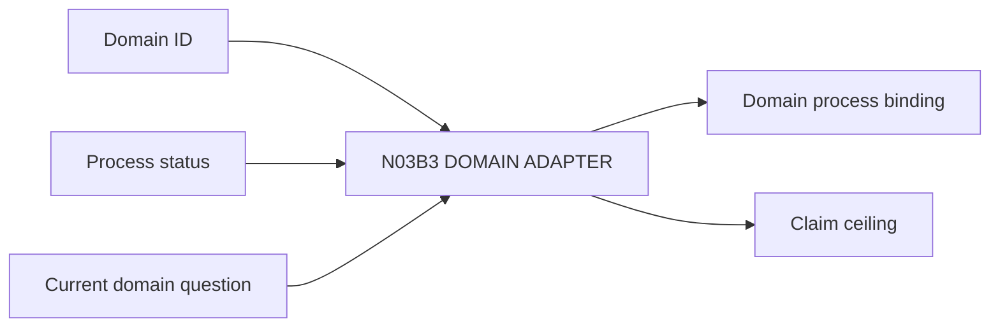

# N03B3｜DOMAIN ADAPTER

[← Parent](../N03B_DEVELOP.md) · [← Atomic Node Index](../ATOMIC_NODE_INDEX.md)

| Field | Value |
|---|---|
| Node ID | N03B3 |
| Parent | N03B DEVELOP |
| Type | Atomic Studio Capability |
| Product job | 把共享 interaction model 绑定到真实专业过程与 native output |
| Inputs | Domain ID; Process status; Current domain question |
| Outputs | Domain process binding; Claim ceiling |
| Authority | Professional authority remains domain-native |
| Primary metric | Cross-domain Transfer Success |
| Release priority | P0 |
| Doc state | WORKING |

## Context Graph

## Product Contract

OPEN domain process 可以探索，但不能产生 professional PASS。

## Requirement Links

- `DEV-F08`
- `INT-F28`

## Acceptance

1. 有 process_ref/native output/readback method/HOLD condition
2. 不制造 universal professional stage

## Failure / Degraded Behaviour

- process unavailable → bounded exploration + HOLD professional claim

## Events / Metrics

- `domain_adapter_bound`
- `domain_process_open`

## Relations

- Feeds N03B2/N06/N07D
