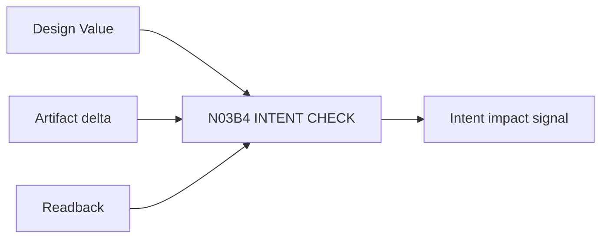

# N03B4｜INTENT CHECK

[← Parent](../N03B_DEVELOP.md) · [← Atomic Node Index](../ATOMIC_NODE_INDEX.md)

| Field | Value |
|---|---|
| Node ID | N03B4 |
| Parent | N03B DEVELOP |
| Type | Atomic Studio Capability |
| Product job | 检查深化结果是否 strengthen/retain/transform/weaken 原 Design Value |
| Inputs | Design Value; Artifact delta; Readback |
| Outputs | Intent impact signal |
| Authority | System signal; Human interprets significance |
| Primary metric | Intent Drift Detection |
| Release priority | P1 |
| Doc state | WORKING |

## Context Graph

## Product Contract

系统不能因为局部实现正确就假定整体意图未漂移。

## Requirement Links

- `DEV-F05`

## Acceptance

1. impact 绑定具体 Value/Relation
2. transform/weaken 不自动判 FAIL

## Failure / Degraded Behaviour

- Value unclear → route N02C

## Events / Metrics

- `intent_check_completed`
- `intent_drift_candidate`

## Relations

- Uses N02C/N06D
- Feeds N07

