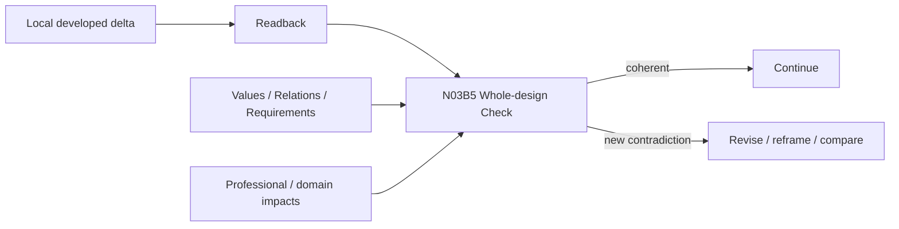

# N03B5｜WHOLE-DESIGN CHECK

[← Parent](../N03B_DEVELOP.md) · [← Atomic Node Index](../ATOMIC_NODE_INDEX.md)

| Field | Value |
|---|---|
| Node ID | N03B5 |
| Parent | N03B DEVELOP |
| Type | Atomic Studio Capability |
| Product job | 在局部深化后检查 whole/local coherence，防止局部修复破坏整体设计 |
| Inputs | Developed delta; Design Values; Relations; Requirements; Domain impacts; Readback |
| Outputs | Whole-design coherence finding; New conflict; Continue/revise signal |
| Authority | System/domain may detect conflicts; consequential whole-design choice remains Human-owned |
| Primary metric | Whole-design Regression Detection |
| Release priority | P0 |
| Doc state | WORKING |

## Context Graph

## Product Contract

`Intent Check` is necessary but insufficient. A change may preserve stated intent while damaging another relation, user outcome, requirement, professional interface or whole-design coherence.

## Requirement Links

- `DEV-F09`
## Acceptance

1. local success does not automatically imply whole-design success
2. new contradictions are tied to affected relation / requirement / domain
3. unaffected valid work remains preserved
4. material whole-design regression reopens only affected scope

## Failure / Degraded Behaviour

- whole-design view unavailable → lower confidence and hold whole-design claim, not all local progress

## Events / Metrics

- `whole_design_check_completed`
- `whole_design_regression_detected`

## Relations

- Consumes N03B4/N05/N06D
- Feeds N05C/N07B/N03B2
