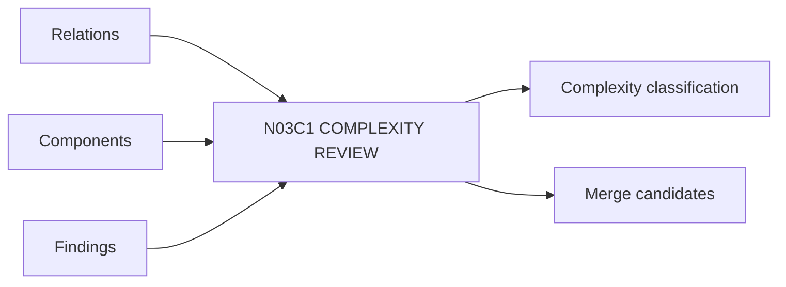

# N03C1｜COMPLEXITY REVIEW

[← Parent](../N03C_SYNTHESIZE.md) · [← Atomic Node Index](../ATOMIC_NODE_INDEX.md)

| Field | Value |
|---|---|
| Node ID | N03C1 |
| Parent | N03C SYNTHESIZE |
| Type | Atomic Studio Capability |
| Product job | 识别 core/supporting/redundant/duplicated/incidental 复杂度 |
| Inputs | Relations; Components; Findings |
| Outputs | Complexity classification; Merge candidates |
| Authority | System assists; Human owns material simplification |
| Primary metric | Accepted Simplification |
| Release priority | P1 |
| Doc state | WORKING |

## Context Graph

## Product Contract

复杂度只有在创造足够设计价值时才值得保留。

## Requirement Links

- `SYN-F01`
- `SYN-F02`
- `SYN-F03`

## Acceptance

1. 分类有 relation/value basis
2. 不以‘更少’自动等于‘更好’

## Failure / Degraded Behaviour

- uncertain value → compare before deletion

## Events / Metrics

- `complexity_reviewed`
- `merge_opportunity_created`

## Relations

- Feeds N03C2/N04
