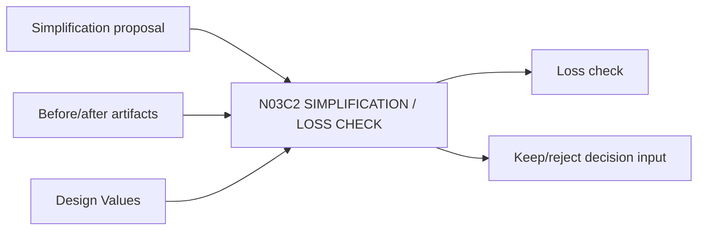

# N03C2｜SIMPLIFICATION / LOSS CHECK

[← Parent](../N03C_SYNTHESIZE.md) · [← Atomic Node Index](../ATOMIC_NODE_INDEX.md)

| Field | Value |
|---|---|
| Node ID | N03C2 |
| Parent | N03C SYNTHESIZE |
| Type | Atomic Studio Capability |
| Product job | 比较简化前后并防止 silent compression / loss |
| Inputs | Simplification proposal; Before/after artifacts; Design Values |
| Outputs | Loss check; Keep/reject decision input |
| Authority | High-impact deletion Human-led |
| Primary metric | Simplification Loss Rejection |
| Release priority | P0 |
| Doc state | WORKING |

## Context Graph

## Product Contract

NO LOSS / NO COMPRESSION：独立有效信息或 relation 的删除必须有显式 rationale。

## Requirement Links

- `SYN-F06`
- `SYN-F07`

## Acceptance

1. before/after 可比较
2. 检查 value/professional function/downstream effect
3. post-change whole readback

## Failure / Degraded Behaviour

- material loss → reject/revise simplification

## Events / Metrics

- `simplification_tested`
- `material_loss_detected`

## Relations

- Uses N04/N06/N03B4
