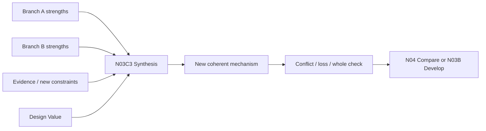

# N03C3｜DESIGN SYNTHESIS

[← Parent](../N03C_SYNTHESIZE.md) · [← Atomic Node Index](../ATOMIC_NODE_INDEX.md)

| Field | Value |
|---|---|
| Node ID | N03C3 |
| Parent | N03C SYNTHESIZE |
| Type | Atomic Studio Capability |
| Product job | 从多个有效方向、反馈、证据和新约束中形成一个新的 coherent design mechanism，而不是简单拼接 |
| Inputs | Promising branches; Human steer; Findings; New evidence/constraints; Design Values |
| Outputs | Synthesized direction; Inheritance map; Resolved/unresolved conflicts |
| Authority | AI may propose synthesis; Human owns consequential adoption |
| Primary metric | Synthesis Usefulness / Coherence |
| Release priority | P0 |
| Doc state | WORKING |

## Context Graph



## Product Contract

Synthesis must explain:

```text
inherited
transformed
newly introduced
intentionally discarded
resolved conflict
unresolved conflict
why the new mechanism is coherent
```

`MIX` is a Human steering operation; `SYNTHESIS` is a design-generation operation. They can interact but are not the same thing.

## Requirement Links

- `SYN-F08`
- `SYN-F02`
## Acceptance

1. result is not a collage of source branches
2. inheritance and transformation are traceable
3. unresolved contradiction remains visible
4. synthesized direction receives a new branch identity / lineage
5. Human is not told the synthesis is “better” without trade-off evidence

## Failure / Degraded Behaviour

- branches are fundamentally incompatible → expose conflict and keep separate alternatives
- synthesis introduces material loss → route N03C2

## Events / Metrics

- `design_synthesis_created`
- `synthesis_conflict_detected`

## Relations

- Consumes N03A/N04/N07/N08
- Feeds N03B/N04/N06
