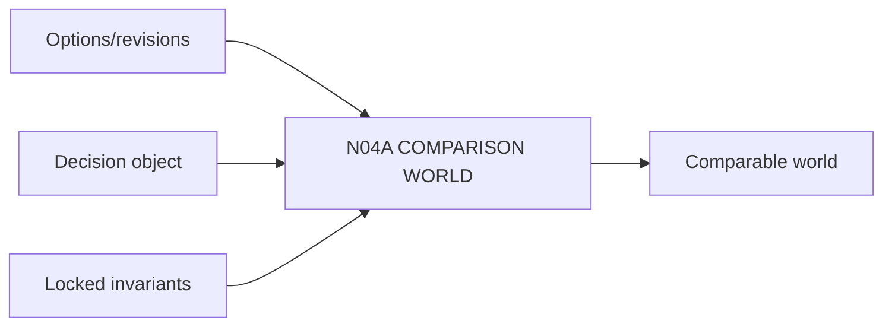

# N04A｜COMPARISON WORLD

[← Parent](../N04_COMPARE.md) · [← Atomic Node Index](../ATOMIC_NODE_INDEX.md)

| Field | Value |
|---|---|
| Node ID | N04A |
| Parent | N04 COMPARE |
| Type | Atomic Decision Capability |
| Product job | 建立同一 decision object 下可公平比较的对象集合 |
| Inputs | Options/revisions; Decision object; Locked invariants |
| Outputs | Comparable world |
| Authority | System structures; Human decides |
| Primary metric | Comparison Validity |
| Release priority | P0 |
| Doc state | WORKING |

## Context Graph

## Product Contract

必须显式比较 fidelity、revision、assumptions 和 key unknown。

## Requirement Links

- `CMP-F01`
- `CMP-F09`
- `CMP-F10`

## Acceptance

1. same decision object
2. same locked invariants
3. artifact revision bound

## Failure / Degraded Behaviour

- fidelity mismatch → visible warning or normalization

## Events / Metrics

- `comparison_world_created`
- `comparison_opened`

## Relations

- Consumes N03A2/N06C
- Feeds N04B
