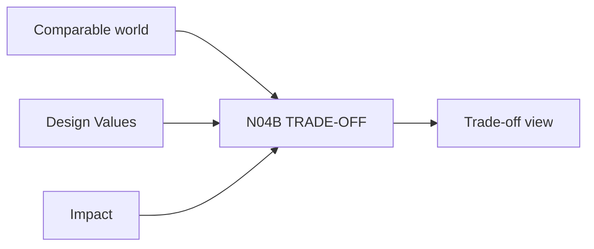

# N04B｜TRADE-OFF

[← Parent](../N04_COMPARE.md) · [← Atomic Node Index](../ATOMIC_NODE_INDEX.md)

| Field | Value |
|---|---|
| Node ID | N04B |
| Parent | N04 COMPARE |
| Type | Atomic Decision Capability |
| Product job | 把 option gain/loss/uncertainty/downstream consequence 显性化 |
| Inputs | Comparable world; Design Values; Impact |
| Outputs | Trade-off view |
| Authority | System exposes; Human values |
| Primary metric | Decision Usefulness |
| Release priority | P0 |
| Doc state | WORKING |

## Context Graph

## Product Contract

不输出 synthetic winner score。

## Requirement Links

- `CMP-F02`
- `CMP-F03`
- `CMP-F04`
- `CMP-F05`

## Acceptance

1. relation/consequence differences visible
2. uncertainty separated from known
3. affected values explicit

## Failure / Degraded Behaviour

- evidence insufficient → show uncertainty/claim limit

## Events / Metrics

- `tradeoff_exposed`

## Relations

- Uses N05B/N08C
- Feeds N04C
