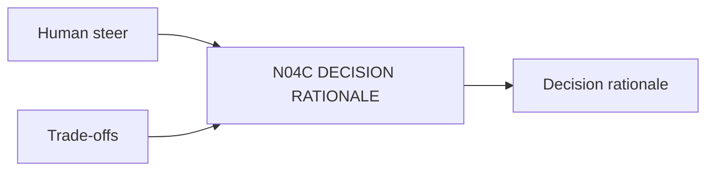

# N04C｜DECISION RATIONALE

[← Parent](../N04_COMPARE.md) · [← Atomic Node Index](../ATOMIC_NODE_INDEX.md)

| Field | Value |
|---|---|
| Node ID | N04C |
| Parent | N04 COMPARE |
| Type | Atomic Decision Capability |
| Product job | 保存 Human consequential decision 的 basis、accepted cost 与 unresolved concern |
| Inputs | Human steer; Trade-offs |
| Outputs | Decision rationale |
| Authority | Human-owned; AI cannot fabricate missing reason |
| Primary metric | Rationale Coverage |
| Release priority | P0 |
| Doc state | WORKING |

## Context Graph

## Product Contract

没有 Human reason 时保留 reason=UNKNOWN，而不是补写漂亮解释。

## Requirement Links

- `CMP-F06`
- `HIS-F02`

## Acceptance

1. actor/authority/basis/accepted cost 绑定
2. decision links exact referent/revision

## Failure / Degraded Behaviour

- Human chooses without reason → save decision, leave rationale absent

## Events / Metrics

- `decision_recorded`

## Relations

- Feeds N09A/N04D/N10B
