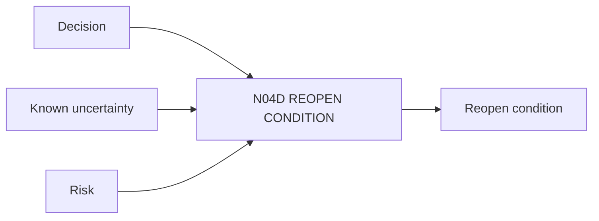

# N04D｜REOPEN CONDITION

[← Parent](../N04_COMPARE.md) · [← Atomic Node Index](../ATOMIC_NODE_INDEX.md)

| Field | Value |
|---|---|
| Node ID | N04D |
| Parent | N04 COMPARE |
| Type | Atomic Decision Capability |
| Product job | 定义什么新证据、情境或失败会让已做决定重新开放 |
| Inputs | Decision; Known uncertainty; Risk |
| Outputs | Reopen condition |
| Authority | Human-led |
| Primary metric | Appropriate Reopen Rate |
| Release priority | P1 |
| Doc state | WORKING |

## Context Graph

## Product Contract

Decision closure 不是永久冻结；reopen condition 使长期项目可解释地改变。

## Requirement Links

- `CMP-F07`
- `HIS-F02`

## Acceptance

1. condition 可观察
2. reopen 保留历史 lineage

## Failure / Degraded Behaviour

- 没有明确 condition → retain unresolved concern

## Events / Metrics

- `reopen_condition_set`
- `decision_reopened`

## Relations

- Feeds N09A/N09B/N02F
