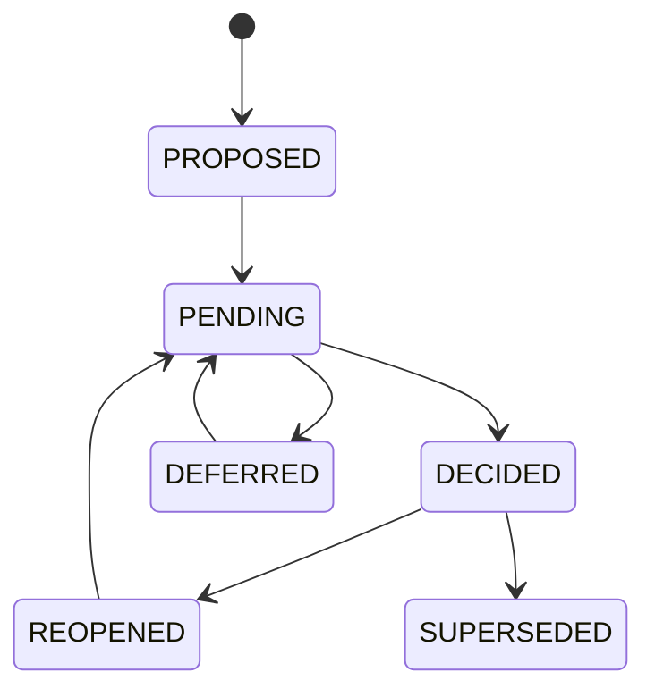

# N04E｜DESIGN DECISION

[← Parent](../N04_COMPARE.md) · [← Atomic Node Index](../ATOMIC_NODE_INDEX.md)

| Field | Value |
|---|---|
| Node ID | N04E |
| Parent | N04 COMPARE |
| Type | Atomic Decision Object |
| Product job | 维护 consequential design decision 的生命周期，而不是只保存一次 Human steer 或历史记录 |
| Inputs | Decision object; Options; Human steer; Scoped rights; Trade-offs; Evidence |
| Outputs | Persistent Design Decision; status; affected relations/artifacts; reopen/supersession links |
| Authority | Consequential decision requires valid Human / owner-native decision rights |
| Primary metric | Decision Trace / Reopen Integrity |
| Release priority | P0 |
| Doc state | WORKING |

## Context Graph



## Product Contract

Design Decision is the durable project object for consequential choice. Human Steer is the interaction input; Decision History is the historical view. Neither replaces the Decision object itself.

A Decision may originate from Compare, Focus, Review, People/Authority or direct valid Human instruction. N04 is its product-document home because Compare is a major decision mode; side-by-side comparison is **not** required for every decision.

## Minimum Decision Object

```text
decision_id
decision_object
options_considered
selected / held / rejected
actor
authority_basis
rationale
tradeoffs
accepted_cost
uncertainty
affected_relations
affected_artifacts
status
reopen_condition
superseded_by
```

## Requirement Links

- `CMP-F06`
- `CMP-F07`
- `CMP-F11`
- `CMP-F12`
## Acceptance

1. SELECT / MODIFY / MIX / REJECT / DEFER binds to a decision object when consequential
2. Human reason is UNKNOWN if not supplied, never fabricated
3. decision status survives session boundary through owner-native carriers
4. reopened/superseded decision keeps prior lineage
5. History records the decision; History does not own it

## Failure / Degraded Behaviour

- decision rights unclear → PENDING/HOLD affected effect
- referent ambiguous → no consequential mutation

## Events / Metrics

- `design_decision_created`
- `design_decision_updated`
- `design_decision_reopened`

## Relations

- Consumes N04A/N04B/N04C/N04D/N10B/N11B
- May also be triggered by N02/N07/N11 when a consequential decision is valid without an option-comparison step
- Feeds N05/N06/N09A
