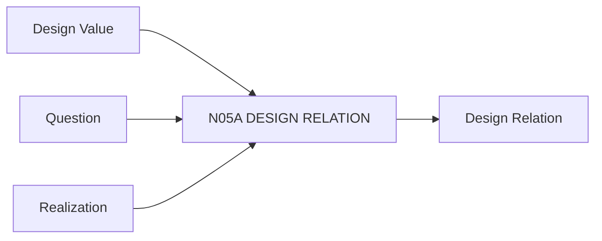

# N05A｜DESIGN RELATION

[← Parent](../N05_MAP.md) · [← Atomic Node Index](../ATOMIC_NODE_INDEX.md)

| Field | Value |
|---|---|
| Node ID | N05A |
| Parent | N05 MAP |
| Type | Atomic Relation Node |
| Product job | 把 materially important 设计关系变成可追踪对象 |
| Inputs | Design Value; Question; Realization |
| Outputs | Design Relation |
| Authority | Human/system can propose; significance remains design judgment |
| Primary metric | Relation Usefulness / Maintenance Burden |
| Release priority | P0 |
| Doc state | WORKING |

## Context Graph

## Product Contract

只有会影响判断、change impact、integration、continuity 或 review 的关系才升级为 first-class relation。

## Requirement Links

- `MAP-F01`
- `MAP-F02`
- `MAP-F03`
- `MAP-F04`

## Acceptance

1. relation 说明 subject/relation/object/significance
2. linked Value/Question 可追溯
3. generic ‘related to’ 不够

## Failure / Degraded Behaviour

- 关系意义不明 → 保持 local note，不强制 first-class

## Events / Metrics

- `relation_created`
- `relation_linked`
- `relation_stability_changed`

## Relations

- Feeds N05B Change Impact
- Links N06 artifacts and N07 findings
