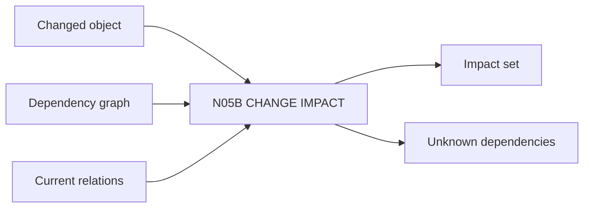

# N05B｜CHANGE IMPACT

[← Parent](../N05_MAP.md) · [← Atomic Node Index](../ATOMIC_NODE_INDEX.md)

| Field | Value |
|---|---|
| Node ID | N05B |
| Parent | N05 MAP |
| Type | Atomic Relation Node |
| Product job | 识别一个变化会真实影响哪些 relation、artifact、decision、domain 与验证 |
| Inputs | Changed object; Dependency graph; Current relations |
| Outputs | Impact set; Unknown dependencies |
| Authority | Analytical projection; does not grant domain authority |
| Primary metric | Change Impact Precision |
| Release priority | P0 |
| Doc state | WORKING |

## Context Graph

## Product Contract

Change Impact 以显式依赖为主；未知依赖必须显示 UNKNOWN，而不是默认 unaffected。

## Requirement Links

- `MAP-F05`
- `MAP-F10`
- `UN-P20`
- `UN-P36`

## Acceptance

1. direct/downstream effects separated
2. affected 与 unknown 分开
3. 不默认 global reopen

## Failure / Degraded Behaviour

- dependency incomplete → preserve UNKNOWN
- domain owner unavailable → impact known, decision pending

## Events / Metrics

- `change_impact_requested`
- `change_impact_resolved`

## Relations

- Consumes N05A
- Feeds N05C Revision Scope
- Used by N04B Trade-off
