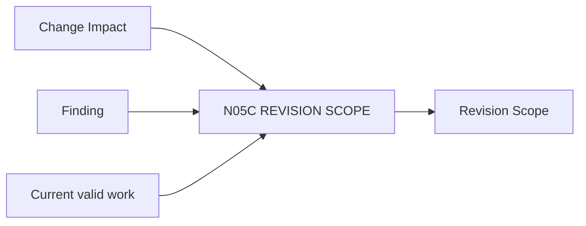

# N05C｜REVISION SCOPE

[← Parent](../N05_MAP.md) · [← Atomic Node Index](../ATOMIC_NODE_INDEX.md)

| Field | Value |
|---|---|
| Node ID | N05C |
| Parent | N05 MAP |
| Type | Atomic Recovery Node |
| Product job | 把失败或变化限定到 AFFECTED / PRESERVED / UNKNOWN 范围 |
| Inputs | Change Impact; Finding; Current valid work |
| Outputs | Revision Scope |
| Authority | Scope projection may be challenged by Human/domain owner |
| Primary metric | Full-reset Avoidance / Preserved-valid-work |
| Release priority | P0 |
| Doc state | WORKING |

## Context Graph

## Product Contract

Revision Scope 是局部恢复核心：只重开真实依赖范围，显式保护仍有效工作。

## Requirement Links

- `MAP-F11`
- `REV-F07`
- `UN-P36`

## Acceptance

1. AFFECTED/PRESERVED/UNKNOWN 都显式
2. scope 可追溯 dependency basis
3. repair 后重新 readback

## Failure / Degraded Behaviour

- scope uncertain → UNKNOWN，不把全部标 AFFECTED

## Events / Metrics

- `revision_scope_created`
- `scope_preserved`

## Relations

- Consumes N05B/N07B
- Feeds N03B/N07G
