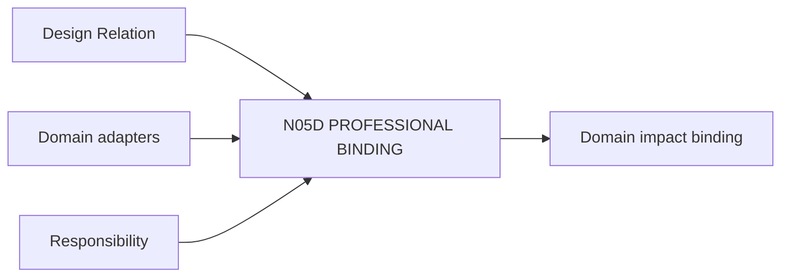

# N05D｜PROFESSIONAL BINDING

[← Parent](../N05_MAP.md) · [← Atomic Node Index](../ATOMIC_NODE_INDEX.md)

| Field | Value |
|---|---|
| Node ID | N05D |
| Parent | N05 MAP |
| Type | Atomic Integration Node |
| Product job | 把关系变化映射到真实专业参与者、shared variable 和 response requirement |
| Inputs | Design Relation; Domain adapters; Responsibility |
| Outputs | Domain impact binding |
| Authority | Professional claim remains domain-owned |
| Primary metric | Cross-domain Conflict Detection |
| Release priority | P1 |
| Doc state | WORKING |

## Context Graph

## Product Contract

Professional Binding 协调接口，不授予任何专业 whole-design authority。

## Requirement Links

- `MAP-F09`
- `DEV-F08`
- `PEO-F02`

## Acceptance

1. 参与 domain、shared variable、required response 明确
2. OPEN domain 不产生 professional PASS

## Failure / Degraded Behaviour

- domain process missing → HOLD relevant claim only

## Events / Metrics

- `professional_binding_created`
- `domain_conflict_detected`

## Relations

- Uses N03B3/N11
- Feeds N05B/N07D
