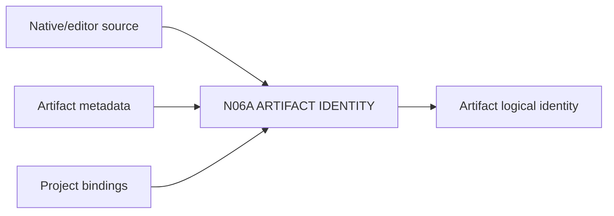

# N06A｜ARTIFACT IDENTITY

[← Parent](../N06_ARTIFACTS.md) · [← Atomic Node Index](../ATOMIC_NODE_INDEX.md)

| Field | Value |
|---|---|
| Node ID | N06A |
| Parent | N06 ARTIFACTS |
| Type | Atomic Reality Node |
| Product job | 维护一个设计产物的逻辑身份、native source 与表示关系 |
| Inputs | Native/editor source; Artifact metadata; Project bindings |
| Outputs | Artifact logical identity |
| Authority | Native owner remains canonical |
| Primary metric | Artifact Identity Correction |
| Release priority | P0 |
| Doc state | WORKING |

## Context Graph

## Product Contract

文件名、最近修改时间、preview 不能单独定义 logical artifact identity。

## Requirement Links

- `ART-F01`
- `ART-F03`

## Acceptance

1. logical object 与 native source 可定位
2. representation 与 source 分开
3. active relation/question binding 可追踪

## Failure / Degraded Behaviour

- native missing → preserve identity + mark unavailable
- duplicate names → resolve by identity/revision

## Events / Metrics

- `artifact_registered`
- `native_source_resolved`

## Relations

- Parent of N06B/N06C
- Feeds N01D
