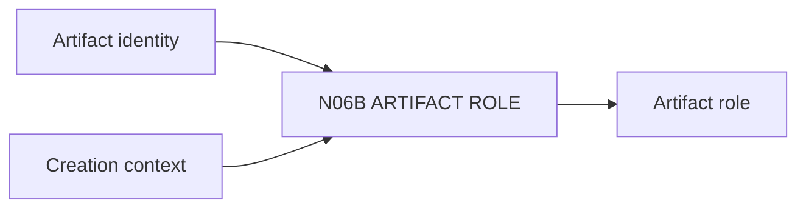

# N06B｜ARTIFACT ROLE

[← Parent](../N06_ARTIFACTS.md) · [← Atomic Node Index](../ATOMIC_NODE_INDEX.md)

| Field | Value |
|---|---|
| Node ID | N06B |
| Parent | N06 ARTIFACTS |
| Type | Atomic Reality Node |
| Product job | 明确 artifact 是 source、prototype、export、preview、simulation、reference 或 AI visual |
| Inputs | Artifact identity; Creation context |
| Outputs | Artifact role |
| Authority | Role cannot silently change authority |
| Primary metric | Role Misclassification Rate |
| Release priority | P0 |
| Doc state | WORKING |

## Context Graph

## Product Contract

Role 决定 claim 与编辑路径；presentation derivative 不因更‘新’而自动成为 source。

## Requirement Links

- `ART-F02`

## Acceptance

1. role visible
2. role transition explicit
3. AI visual 不冒充 native master

## Failure / Degraded Behaviour

- role unknown → UNKNOWN, restrict claim

## Events / Metrics

- `artifact_role_set`
- `artifact_role_conflict`

## Relations

- Consumes N06A
- Feeds N06E Claim Ceiling
