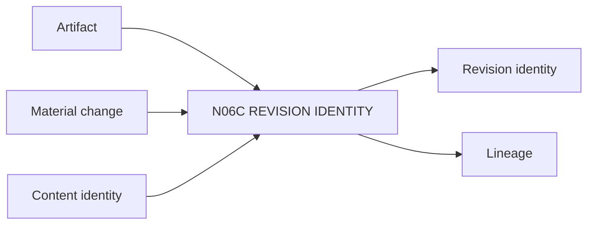

# N06C｜REVISION IDENTITY

[← Parent](../N06_ARTIFACTS.md) · [← Atomic Node Index](../ATOMIC_NODE_INDEX.md)

| Field | Value |
|---|---|
| Node ID | N06C |
| Parent | N06 ARTIFACTS |
| Type | Atomic Reality Node |
| Product job | 识别 materially meaningful artifact change，并绑定 exact revision/content identity |
| Inputs | Artifact; Material change; Content identity |
| Outputs | Revision identity; Lineage |
| Authority | Revision semantics do not alter Project Current by themselves |
| Primary metric | Revision Mismatch Rate |
| Release priority | P0 |
| Doc state | WORKING |

## Context Graph

## Product Contract

timestamp 或 metadata touch 不算 meaningful design revision；重要 readback/steer 必须绑定 exact revision/content identity。

## Requirement Links

- `ART-F04`
- `ART-F10`

## Acceptance

1. material change creates revision
2. content hash/equivalent identity used when available
3. parent lineage preserved

## Failure / Degraded Behaviour

- same revision label but changed content → integrity conflict

## Events / Metrics

- `artifact_revision_created`
- `revision_integrity_conflict`

## Relations

- Feeds N06D/N04A/N10B
