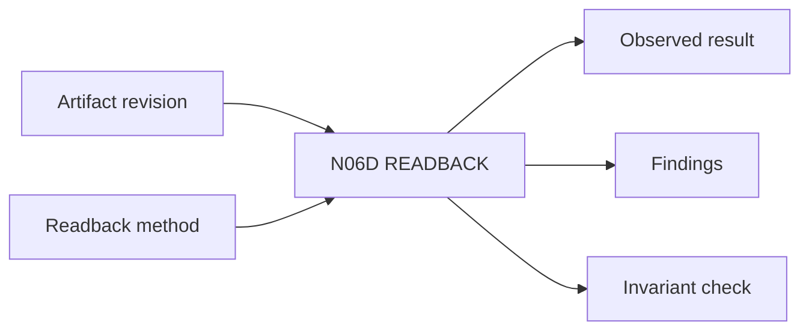

# N06D｜READBACK

[← Parent](../N06_ARTIFACTS.md) · [← Atomic Node Index](../ATOMIC_NODE_INDEX.md)

| Field | Value |
|---|---|
| Node ID | N06D |
| Parent | N06 ARTIFACTS |
| Type | Atomic Reality Node |
| Product job | 实际查看/读取 material result，确认发生了什么而不是相信执行声明 |
| Inputs | Artifact revision; Readback method |
| Outputs | Observed result; Findings; Invariant check |
| Authority | Evidence of result; not Design KEEP |
| Primary metric | Readback Completion / Revision Integrity |
| Release priority | P0 |
| Doc state | WORKING |

## Context Graph

## Product Contract

Tool success、producer assertion、file existence 都不能替代 actual readback。

## Requirement Links

- `ART-F07`
- `REV-F13`
- `INT-F21`

## Acceptance

1. readback 绑定 exact revision/content
2. 记录 expected vs observed
3. material invariant 可核验

## Failure / Degraded Behaviour

- artifact unreadable → no validated/done claim
- readback old revision → current remains unread

## Events / Metrics

- `readback_started`
- `readback_completed`
- `readback_revision_mismatch`

## Relations

- Consumes N06C
- Feeds N07/N03B4/N10B
