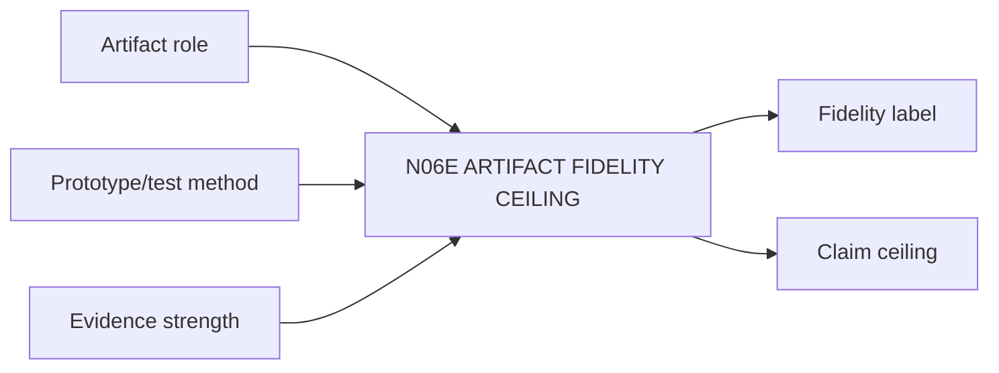

# N06E｜ARTIFACT FIDELITY CEILING

[← Parent](../N06_ARTIFACTS.md) · [← Atomic Node Index](../ATOMIC_NODE_INDEX.md)

| Field | Value |
|---|---|
| Node ID | N06E |
| Parent | N06 ARTIFACTS |
| Type | Atomic Evidence Node |
| Product job | 定义当前 artifact / prototype fidelity 在表示与测试层面能支持什么、不能支持什么 |
| Inputs | Artifact role; Prototype/test method; Evidence strength |
| Outputs | Fidelity label; Artifact-side claim ceiling |
| Authority | System/domain can constrain claims; cannot inflate them |
| Primary metric | Claim-ceiling Violation Rate |
| Release priority | P0 |
| Doc state | WORKING |

## Context Graph

## Product Contract

低 fidelity 可以支持探索，但不能支持更高强度 professional/validation claim。最终 claim ceiling 还必须与 N08E 的 evidence/applicability ceiling 组合，不能由 artifact fidelity 单独决定。

## Requirement Links

- `ART-F09`
- `KNW-F11`
- `REV-F12`

## Acceptance

1. does-not-prove 显式
2. role/fidelity/claim 一致
3. render 不证明 material performance

## Failure / Degraded Behaviour

- fidelity unknown → conservative claim ceiling

## Events / Metrics

- `claim_ceiling_set`
- `claim_ceiling_violation`

## Relations

- Consumes N06B/N08B
- Feeds N07D/N07E
