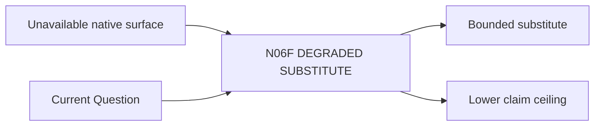

# N06F｜DEGRADED SUBSTITUTE

[← Parent](../N06_ARTIFACTS.md) · [← Atomic Node Index](../ATOMIC_NODE_INDEX.md)

| Field | Value |
|---|---|
| Node ID | N06F |
| Parent | N06 ARTIFACTS |
| Type | Atomic Degraded Node |
| Product job | native surface 暂不可用时，用真实可编辑替代载体回答当前 key unknown |
| Inputs | Unavailable native surface; Current Question |
| Outputs | Bounded substitute; Lower claim ceiling |
| Authority | Cannot claim native completion |
| Primary metric | Degraded-workflow Success |
| Release priority | P1 |
| Doc state | WORKING |

## Context Graph

## Product Contract

替代物必须能回答当前问题，并显式降低 completion/professional claim。

## Requirement Links

- `ART-F12`
- `NFR-10`

## Acceptance

1. substitute editable/truthful
2. key unknown 可回答
3. native completion HOLD

## Failure / Degraded Behaviour

- 无 truthful substitute → N10C Human Stop/HOLD

## Events / Metrics

- `degraded_substitute_used`

## Relations

- Uses N06E
- Feeds N10C/N12C
