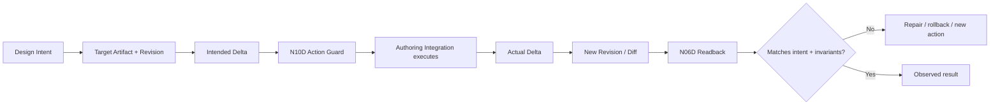

# N06G｜ARTIFACT ACTION / MAKE

[← Parent](../N06_ARTIFACTS.md) · [← Atomic Node Index](../ATOMIC_NODE_INDEX.md)

| Field | Value |
|---|---|
| Node ID | N06G |
| Parent | N06 ARTIFACTS |
| Type | Atomic Reality / Execution Node |
| Product job | 把 design intent 转成针对真实 artifact 的可执行 make/edit action，并核对 intended delta 与 actual delta |
| Inputs | Design action; Target artifact/revision; Intended delta; Permission; Tool capability |
| Outputs | Actual delta; New revision; Diff/change set; Rollback/recovery locator; Readback request |
| Authority | Action execution follows N10D Action Guard and owner-native artifact authority |
| Primary metric | Intended-to-Actual Delta Match |
| Release priority | P0 |
| Doc state | WORKING |

## Action Types

```text
CREATE
EDIT
TRANSFORM
DELETE
BRANCH
MERGE
EXPORT
SYNC
```

## Context Graph



## Product Contract

OLEANDER owns the **design action contract** even when CAD/BIM/Figma/IDE/3D tools own authoring execution. Tool success is not completion; the actual delta and readback are required.

## Requirement Links

- `ART-F13`
- `ART-F04`
- `ART-F07`
## Acceptance

1. action binds exact target artifact/revision
2. intended delta is explicit before material change
3. actual delta is observable after execution
4. reversible actions have rollback/recovery locator where the tool permits
5. unintended collateral change becomes a finding, not silent success

## Failure / Degraded Behaviour

- native authoring unavailable → N06F degraded substitute or HOLD native-completion claim
- partial tool success → preserve exact completed/failed delta
- rollback unavailable → side-effect class escalates before execution

## Events / Metrics

- `artifact_action_started`
- `artifact_delta_observed`
- `artifact_action_partial`
- `artifact_rollback_used`

## Relations

- Consumes N03B2/N03C3/N04E/N10D/N12
- Feeds N06C/N06D/N07
