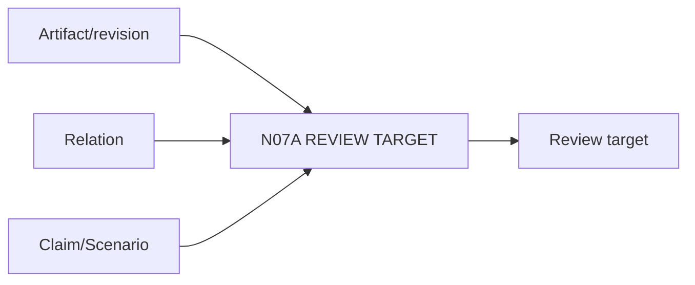

# N07A｜REVIEW TARGET

[← Parent](../N07_REVIEW.md) · [← Atomic Node Index](../ATOMIC_NODE_INDEX.md)

| Field | Value |
|---|---|
| Node ID | N07A |
| Parent | N07 REVIEW |
| Type | Atomic Review Node |
| Product job | 把 review 绑定到真实对象、revision、relation 或 claim |
| Inputs | Artifact/revision; Relation; Claim/Scenario |
| Outputs | Review target |
| Authority | Review scope only |
| Primary metric | Wrong-target Review Rate |
| Release priority | P0 |
| Doc state | WORKING |

## Context Graph

## Product Contract

正式 review 不能只针对 producer summary 或 ambiguous ‘latest’。

## Requirement Links

- `REV-F01`

## Acceptance

1. target identity/revision explicit
2. reviewer knows what is and is not being reviewed

## Failure / Degraded Behaviour

- target ambiguous → no formal verdict

## Events / Metrics

- `review_target_bound`

## Relations

- Consumes N06A/N06C
- Feeds N07B/N07D/N07E
