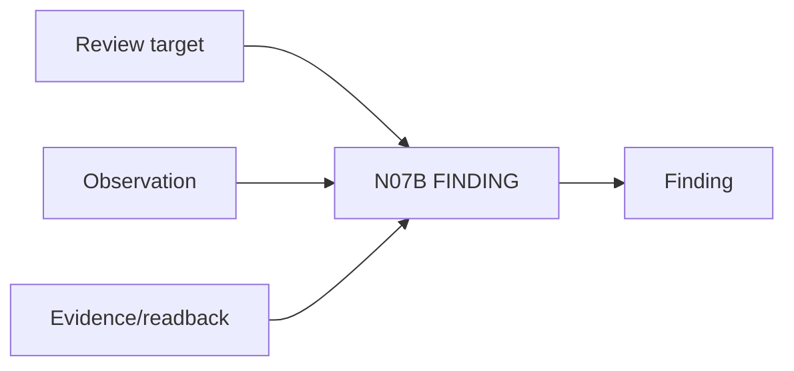

# N07B｜FINDING

[← Parent](../N07_REVIEW.md) · [← Atomic Node Index](../ATOMIC_NODE_INDEX.md)

| Field | Value |
|---|---|
| Node ID | N07B |
| Parent | N07 REVIEW |
| Type | Atomic Review Node |
| Product job | 把 observation/critique 转成可推动设计的 finding |
| Inputs | Review target; Observation; Evidence/readback |
| Outputs | Finding |
| Authority | Finding does not automatically change Current |
| Primary metric | Finding-to-Action Conversion |
| Release priority | P0 |
| Doc state | WORKING |

## Context Graph

## Product Contract

Finding 需要 statement、type、affected object、basis、impact、uncertainty。

## Requirement Links

- `REV-F02`
- `REV-F03`
- `REV-F04`
- `REV-F05`

## Acceptance

1. type 区分 design/professional/evidence/representation/execution/validation
2. major finding 不被平均掉
3. affected relation/object 可定位

## Failure / Degraded Behaviour

- 只有‘感觉不对’ → preserve concern until localized

## Events / Metrics

- `finding_created`
- `finding_severity_set`

## Relations

- Feeds N07C/N05C
