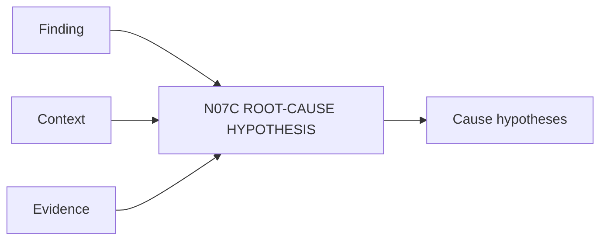

# N07C｜ROOT-CAUSE HYPOTHESIS

[← Parent](../N07_REVIEW.md) · [← Atomic Node Index](../ATOMIC_NODE_INDEX.md)

| Field | Value |
|---|---|
| Node ID | N07C |
| Parent | N07 REVIEW |
| Type | Atomic Review Node |
| Product job | 为 finding 建立一个或多个可被修复/验证的原因假设 |
| Inputs | Finding; Context; Evidence |
| Outputs | Cause hypotheses |
| Authority | Hypothesis ≠ verified cause |
| Primary metric | Repair Hypothesis Accuracy |
| Release priority | P0 |
| Doc state | WORKING |

## Context Graph

## Product Contract

允许多个候选原因；修复必须说明针对哪个 hypothesis，readback 后才能支持或否定。

## Requirement Links

- `REV-F06`

## Acceptance

1. hypothesis 与 finding 分开
2. repair action 可映射 hypothesis
3. post-repair observation 更新支持度

## Failure / Degraded Behaviour

- 原因未知 → keep multiple/open hypotheses

## Events / Metrics

- `root_cause_hypothesis_created`
- `hypothesis_supported`
- `hypothesis_rejected`

## Relations

- Consumes N07B
- Feeds N03B/N07G
