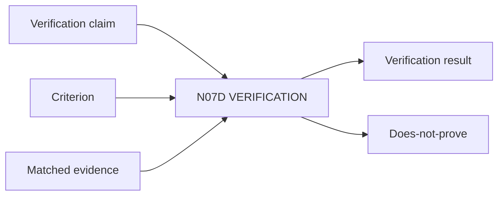

# N07D｜VERIFICATION

[← Parent](../N07_REVIEW.md) · [← Atomic Node Index](../ATOMIC_NODE_INDEX.md)

| Field | Value |
|---|---|
| Node ID | N07D |
| Parent | N07 REVIEW |
| Type | Atomic Assurance Node |
| Product job | 判断是否按已经声明的 requirement/design condition 正确实现 |
| Inputs | Verification claim; Criterion; Matched evidence |
| Outputs | Verification result; Does-not-prove |
| Authority | Professional/domain criteria may require qualified owner |
| Primary metric | Verification Claim Integrity |
| Release priority | P0 |
| Doc state | WORKING |

## Context Graph

## Product Contract

Verification 回答 implemented-as-specified，不回答 real-user effectiveness。

## Requirement Links

- `REV-F11`
- `SR-VF`

## Acceptance

1. claim/criterion/evidence 一一对应
2. evidence fidelity/适用性可见
3. PASS 不升级成 Validation PASS

## Failure / Degraded Behaviour

- evidence insufficient → unsupported/open
- domain authority missing → HOLD professional claim

## Events / Metrics

- `verification_result_recorded`

## Relations

- Uses N06E/N08B/N08C
- Distinct from N07E
