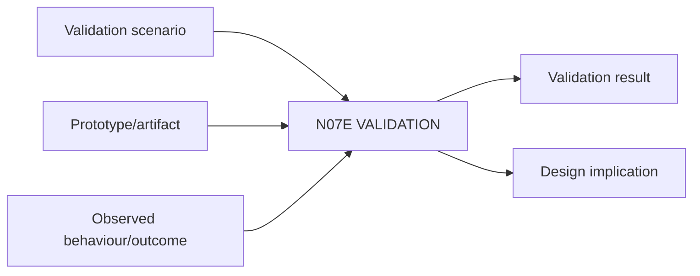

# N07E｜VALIDATION

[← Parent](../N07_REVIEW.md) · [← Atomic Node Index](../ATOMIC_NODE_INDEX.md)

| Field | Value |
|---|---|
| Node ID | N07E |
| Parent | N07 REVIEW |
| Type | Atomic Assurance Node |
| Product job | 判断设计在真实用户、真实情境和真实目标中是否有效 |
| Inputs | Validation scenario; Prototype/artifact; Observed behaviour/outcome |
| Outputs | Validation result; Design implication |
| Authority | Real-user/context evidence required for claim |
| Primary metric | Validation Task/Outcome Success |
| Release priority | P0 |
| Doc state | WORKING |

## Context Graph

## Product Contract

内部自评、verification 或 render 不替代 validation。

## Requirement Links

- `REV-F10`
- `SR-VA`

## Acceptance

1. scenario 定义 who/context/task/outcome/method/limitation
2. result 可触发 reframe/revision
3. evidence population/context 明确

## Failure / Degraded Behaviour

- representative use absent → validation claim HOLD

## Events / Metrics

- `validation_scenario_created`
- `validation_result_recorded`

## Relations

- Uses N02E/N06E
- Feeds N02F/N05C
