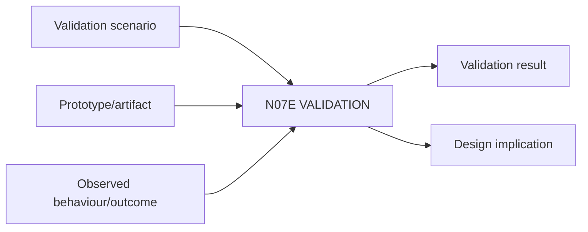

# N07E｜VALIDATION

[← Parent](../N07_REVIEW.md) · [← Atomic Node Index](../ATOMIC_NODE_INDEX.md)

| Field | Value |
|---|---|
| Node ID | N07E |
| Parent | N07 REVIEW |
| Type | Atomic Assurance Node |
| Product job | 判断设计在真实用户、真实情境和真实目标中是否有效 |
| Inputs | Validation scenario; Prototype/artifact; Observed behaviour/outcome |
| Outputs | Validation result; Design implication |
| Authority | Claim strength must not exceed the strongest actually executed validation level |
| Primary metric | Validation Task/Outcome Success |
| Release priority | P0 |
| Doc state | WORKING |

## Context Graph

## Product Contract

内部自评、verification 或 render 不替代 validation；但 validation 不是二元状态。不同专业与设计阶段可以使用不同强度的 validation，claim ceiling 必须匹配实际 level。

## Validation Levels

| Level | Typical evidence | What it can support |
|---|---|---|
| V0 Analytical | analytical reasoning / model / rule-based assessment | bounded hypothesis / risk screen |
| V1 Expert / Scenario | qualified expert or structured scenario review | expert/scenario plausibility |
| V2 Representative Prototype | representative prototype or mock-up | prototype-level behaviour / usability claim |
| V3 User Simulation / Task | representative user task / simulation | task/context effectiveness within tested scenario |
| V4 Field / Operational | live field / operational trial | real-context performance within observed scope |
| V5 Post-use / Longitudinal | longitudinal or post-use evidence | sustained real-use outcome within observed population/context |

Not every domain must reach V5 before a design decision. The system must state the level actually achieved and what it does **not** prove.

These are **validation-evidence levels, not professional stages**. They are non-linear, domain-adapted and may be combined; they do not create a universal stage model or replace domain-native validation requirements.

## Requirement Links

- `REV-F10`
- `SR-VA`

## Acceptance

1. scenario 定义 who/context/task/outcome/method/limitation
2. result 可触发 reframe/revision
3. evidence population/context 明确

## Failure / Degraded Behaviour

- requested claim stronger than executed validation level → lower claim ceiling / HOLD that stronger claim
- representative use absent → no V3+ user-effectiveness claim, but V0–V2 evidence may remain valid

## Events / Metrics

- `validation_scenario_created`
- `validation_result_recorded`

## Relations

- Uses N02E/N06E
- Feeds N02F/N05C
