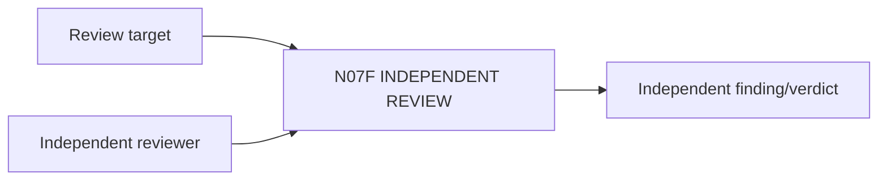

# N07F｜INDEPENDENT REVIEW

[← Parent](../N07_REVIEW.md) · [← Atomic Node Index](../ATOMIC_NODE_INDEX.md)

| Field | Value |
|---|---|
| Node ID | N07F |
| Parent | N07 REVIEW |
| Type | Atomic Review Node |
| Product job | 保持 reviewer 与 producer 的判断独立，并保留重大 disagreement |
| Inputs | Review target; Independent reviewer |
| Outputs | Independent finding/verdict |
| Authority | Reviewer does not become project authority automatically |
| Primary metric | Independent Review Integrity |
| Release priority | P1 |
| Doc state | WORKING |

## Context Graph

## Product Contract

producer critique ≠ independent review；多个 reviewer disagreement 不被最新意见静默覆盖。

## Requirement Links

- `REV-F09`
- `UN-P33`

## Acceptance

1. reviewer independence可说明
2. disagreement preserved
3. scope/authority explicit

## Failure / Degraded Behaviour

- same producer/reviewer → label non-independent

## Events / Metrics

- `independent_review_started`
- `disagreement_recorded`

## Relations

- Uses N11
- Feeds N07B/N09
