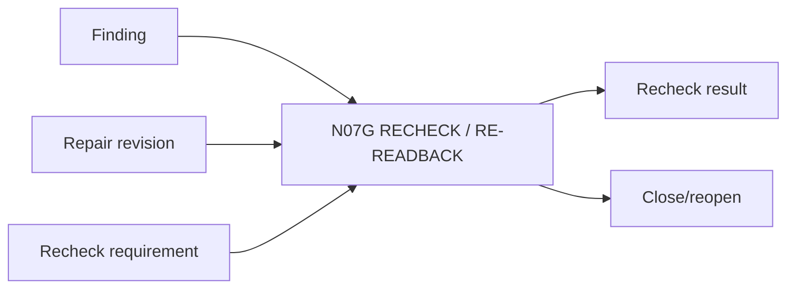

# N07G｜RECHECK / RE-READBACK

[← Parent](../N07_REVIEW.md) · [← Atomic Node Index](../ATOMIC_NODE_INDEX.md)

| Field | Value |
|---|---|
| Node ID | N07G |
| Parent | N07 REVIEW |
| Type | Atomic Recovery Node |
| Product job | 定义修复后必须重新检查什么，防止‘已修改’直接关闭问题 |
| Inputs | Finding; Repair revision; Recheck requirement |
| Outputs | Recheck result; Close/reopen |
| Authority | Closure requires matching evidence |
| Primary metric | Revision Re-readback Rate |
| Release priority | P0 |
| Doc state | WORKING |

## Context Graph

## Product Contract

重要 finding 修复后必须重新读真实结果，并检查受影响 whole/local/domain states。

## Requirement Links

- `REV-F08`
- `REV-F13`

## Acceptance

1. recheck target/method 明确
2. exact repaired revision 被读取
3. close/reopen 有 evidence basis

## Failure / Degraded Behaviour

- repair exists but unread → finding remains open

## Events / Metrics

- `recheck_required`
- `finding_closed`
- `finding_reopened`

## Relations

- Consumes N07C/N05C/N06D
- Feeds N09
