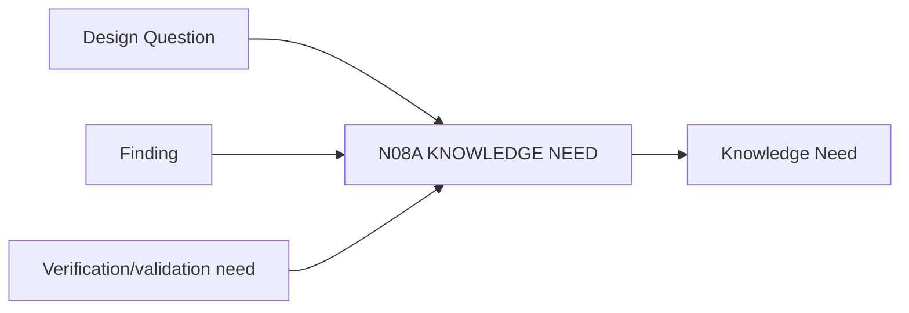

# N08A｜KNOWLEDGE NEED

[← Parent](../N08_KNOWLEDGE.md) · [← Atomic Node Index](../ATOMIC_NODE_INDEX.md)

| Field | Value |
|---|---|
| Node ID | N08A |
| Parent | N08 KNOWLEDGE |
| Type | Atomic Knowledge Node |
| Product job | 把研究从泛收集收缩到当前设计判断真正需要知道的内容 |
| Inputs | Design Question; Finding; Verification/validation need |
| Outputs | Knowledge Need |
| Authority | Design-question scoped |
| Primary metric | Research-to-Design Conversion |
| Release priority | P0 |
| Doc state | WORKING |

## Context Graph

## Product Contract

Knowledge Need 必须解释 why needed、affected relation、required confidence 和 decision point。

## Requirement Links

- `KNW-F01`

## Acceptance

1. 需求绑定具体 design question/relation
2. 不以‘多搜资料’作为目标

## Failure / Degraded Behaviour

- question unclear → route N02B before broad research

## Events / Metrics

- `knowledge_need_created`

## Relations

- Feeds N08B
- Consumes N02B/N07B
