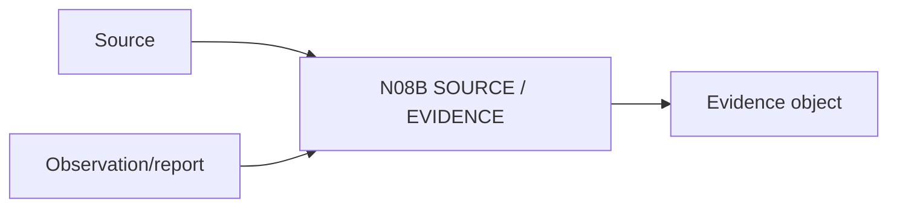

# N08B｜SOURCE / EVIDENCE

[← Parent](../N08_KNOWLEDGE.md) · [← Atomic Node Index](../ATOMIC_NODE_INDEX.md)

| Field | Value |
|---|---|
| Node ID | N08B |
| Parent | N08 KNOWLEDGE |
| Type | Atomic Knowledge Node |
| Product job | 保存来源、provenance、freshness 与证据强度 |
| Inputs | Source; Observation/report |
| Outputs | Evidence object |
| Authority | Source authority depends on provenance/context |
| Primary metric | Evidence Provenance Completeness |
| Release priority | P0 |
| Doc state | WORKING |

## Context Graph

## Product Contract

Source existence ≠ applicability；Evidence 必须保留 date/context/creator/strength。

## Requirement Links

- `KNW-F02`
- `KNW-F03`

## Acceptance

1. primary/secondary、direct/indirect 可区分
2. freshness 可见
3. provenance 可追踪

## Failure / Degraded Behaviour

- source unavailable → evidence unverified, not deleted

## Events / Metrics

- `evidence_linked`
- `evidence_freshness_changed`

## Relations

- Feeds N08C/N08D/N06E/N07D
